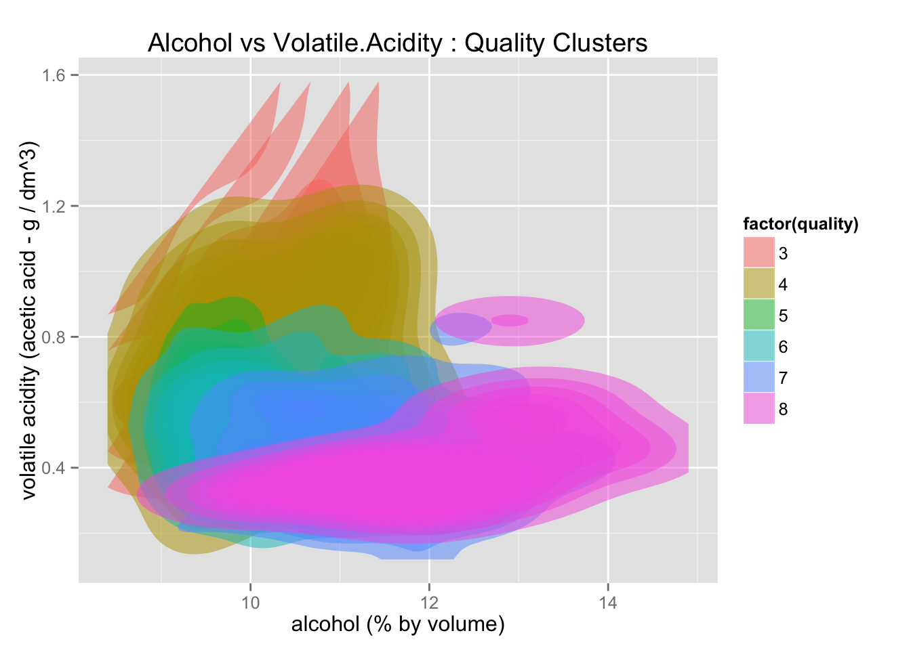

# udacity_data_viz_final_project

## Summary

After performing exploratory data analysis on this particular [set of data](https://github.com/austinjalexander/udacity_eda_final_project/blob/master/_OLD/wineQualityInfo.txt), 
what seemed like obvious groupings emerged. Alcohol, volatile acidity, and sulphates 
appeared to affect the (perceived) quality of red wines, at least among those wine 
experts consulted in the making of the data set. Thus, if I were given a new red 
wine with these properties listed, I would be very confident using my final 
visualization to predict how it would be scored.

## Design
Initially, based on my exploratory data analysis, I wanted to visualize 
clusters of the data (i.e., not individual points). Here is my initial
visualization after exploring (this visualization should be understood as my first
one): 

I wanted to use color to indicate quality scores and the _x_ and _y_ axes 
to show amounts of alcohol and volatile acidity. For the final version of the 
visualization, I chose color to indicate quality scores so that groupings of 
of scores would be easier to see. Making use of the spatial axes for sulphates and 
volatile acidity encodes the relationship between the two features.

However, after receiving some feedback and reflecting, I decided to visualize each data point using a bubble chart, while still using color to indicate quality scores. 
The feedback I received also encouraged me to make certain elements more 
clearly understandable (e.g., explicitly noting that each bubble actually represents a wine, defining some the quantity terms, etc.). Some of these changes, thus, weren't graphical, but textual; for instance, instead of the title
"Chemical Properties of Wine and their Effect on Quality Scores", I changed the
title to the question: "Do chemical properties of wine affect quality?" Also, 
I went from simply listing "Sulphates vs Volatile Acidity" and "Bubbles 
are Sized by Alcohol Percentage" to forming a subtitle: 
"How do sulphates, acidity, and alcohol % affect scores?"

Prior to receiving Udacity feedback, the visualization encoded alcohol as 
bubble radius and all quality scores were colored (see that version here: <a href="pre-udacity-feedback.html" target="_blank">pre-udacity-feedback.html</a>). After receiving Udacity feedback, I removed alcohol as a feature and grouped scores 
together so that only 3 groups remained.

## Feedback
My feedback was mostly positive. Humorously, as more time passed, the feedback
continued to include more and more desired features, many of which I added 
(e.g., the ability to remove/add certain bubbles based on quality score).

Here are some of the (paraphrased) answers I received to the feedback questions that were provided by Udacity:

#### What do you notice in the visualization?
-  "Pink and blurry!" [first version]
-  "The red spikes stick out the most." [first version]
-  "It seems like there are more ratings." [one of the later versions]
-  "It looks pretty clean." [final version]
-  "Very intuitive." [final version]

#### What questions do you have about the data?
-  "Where did you get the data?" [first version]
-  "What kind of alcohol?" [first version]
-  "What are the circles?" [one of the later versions]
-  "Can you apply the same data to other types of alcohol?" [final version]

#### What relationships do you notice?
-  "It seems like the 7 and 8 clusters are grouped similarly." [first version]
-  "High acidity seems to score low." [one of the later versions]
-  "High sulphates, low acidity, and high alcohol content seems to indicate 
a higher score (esp. when comparing scores 3 and 8)." [final version]

#### What do you think is the main takeaway from this visualization?
-  "It seems that the more acidic the alcohol is, 
the worse the quality is." [first version]
-  "This data would probably be helpful for someone who is buying wine." 
[one of the later versions]
-  "In general, if you had access to this information for a paritcular wine
you could guess how it would be rated." [final version]

#### Is there something you don’t understand in the graphic?
-  "What does % by volume mean?" [first version]
-  "What dm^3 is." [one of the later versions]
-  "Nope! I get it!" [final version]

## Resources

https://github.com/PMSI-AlignAlytics/dimple/wiki/dimple.axis

http://dimplejs.org/advanced_examples_viewer.html?id=advanced_interactive_legends

http://dimplejs.org/advanced_examples_viewer.html?id=advanced_storyboard_control

https://github.com/PMSI-AlignAlytics/dimple/wiki/dimple.storyboard